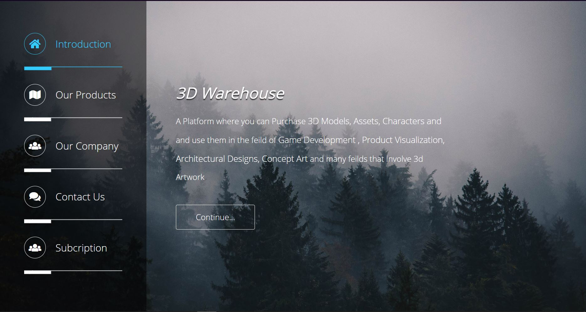
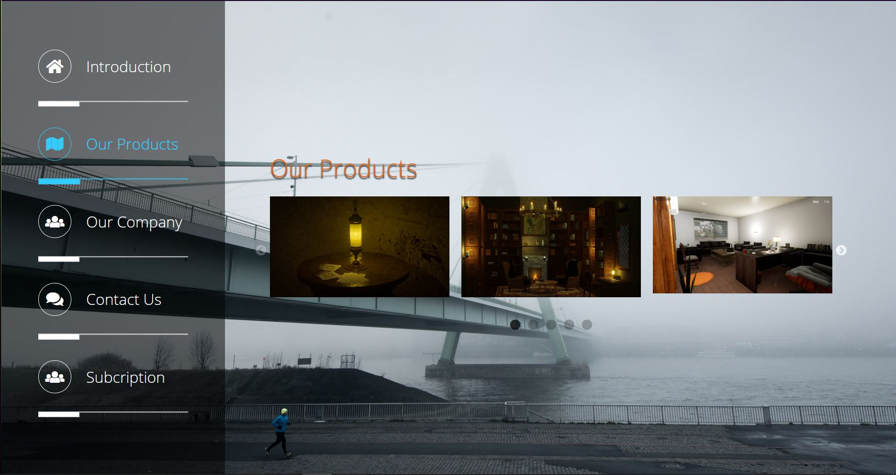
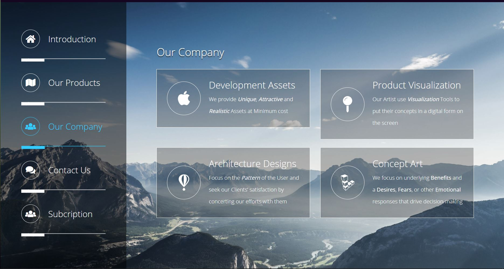
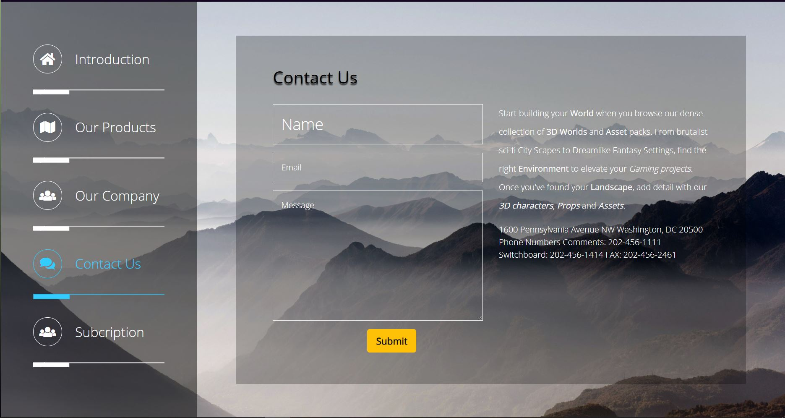
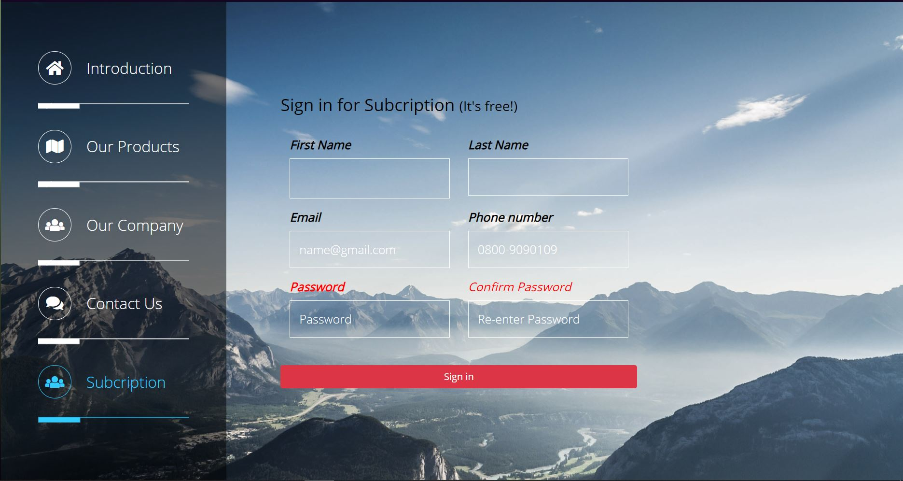

# 3D Warehouse

 

### Tools & Technology used:

 

  
:zap: Most Used Languages

  []

 

# 3D Warehouse Description:

##### The 3D Warehouse is a *Modern Tech* website, that provide most *Experince* and *Talented* 3D Artist.It is the perfect platform, for both Artists and Organizations, where they can easily match and Deal with each other.  

## HomePage(Introduction) :

The Introduction Page describe our Organization services and Deliverables.

 

## Products:
This Page *Visualize* the Artists Artwork, which help the Organization/Firm to evoke their Desired artist *Comfortably*.

 

## Company:
This Page is About our 1-*Agenda* and Our 2-Our *Artists* Area of Work

 

## Contact:

Contact us and ask your questions directly on our website FAQ, call us, or find us on [Twitter][tweet], [Facebook][facebook], [LinkedIn][LinkedIn]

  

## Subcription:
Subscribe to your *Site* or *Services* and Hire Artist on a weekly, monthly or annual basis with Bulk of *Discounts*.

 

## 3D Models:

[TalhaFarooq][Talha]
[MuzammilIqrar][Muzimil]

### P.S Working on Database, Will update later. Forks and Pull Requests will be Highly appreciated, **ENJOY** 💚.

[Talha]:https://www.artstation.com/talhafarooq
[Muzimil]: https://www.artstation.com/sicario07
[tweet]: https://twitter.com/iamhsntariq
[facebook]: https://www.facebook.com/profile.php?id=100006704356942
[LinkedIn]: https://www.linkedin.com/in/hassan-tariq-a290441b3/

